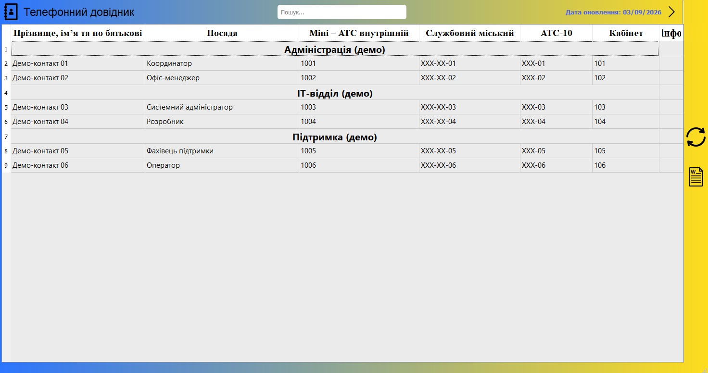
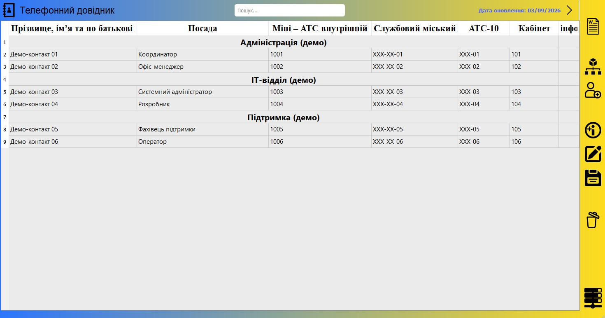

# Phone Directory

Windows phone directory built with Python and PyQt5. A separate administration application manages contacts and departments, while the client provides search, Word export and updates over TCP.

## Download

Windows builds are available on the [Releases page](https://github.com/TonyLayt/Phone-Directory/releases).

Extract the archive and open `client/PhoneDirectoryClient.exe`.

To manage contacts, open `server/PhoneDirectoryAdmin.exe`. Its server button starts the TCP server used for client updates.

## Screenshots

| Client | Administration |
| --- | --- |
|  |  |

## Features

- Contact and department management
- Search with highlighted matches and navigation between results
- SQLite storage and JSON export
- On-demand updates over TCP
- Offline access to downloaded records
- Word export and supporting documents for contacts and departments

## Running from source

Requires Windows and Python 3.

Install the dependencies and create the data folders from the repository root:

```bat
python -m pip install PyQt5 python-docx
if not exist server\docdat mkdir server\docdat
if not exist client\docdat mkdir client\docdat
```

Run each component in a separate terminal, starting from the repository root.

### Administration

```bat
cd server
python main.py
```

The database is created on first launch. Add and save contacts to generate the JSON file used for client updates.

### TCP server

```bat
cd server
python telephone_directory_server.py
```

Keep the server running while downloading updates. When running from source, use this command instead of the administration application's server button, which expects an `.exe`.

### Client

```bat
cd client
python main.py
```

Press the refresh button to download updates. Downloaded records remain available when the server is offline.

The default connection is `localhost:8000`. TCP transfers have no authentication or encryption; do not expose the server to the public internet.